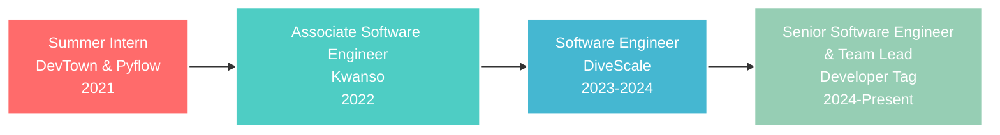

<div align="center">
  
</div>

<div align="center">
  
  [](https://git.io/typing-svg)
  
</div>

<br/>

<div align="center">
  
  
  
</div>

---

## 🚀 **About Me**


🎓 **PUCIT Graduate** with **4.0 CGPA** in core programming subjects  
💼 **Senior Software Engineer & Team Lead** at Developer Tag  
🏆 **Top 10 Rank** in ICPC Asia Online Preliminary Programming Contest 2023  
⭐ **LeetCode Top 5%** Problem Solver  
🌟 **"Student of the Year"** at Akhuwat College Kasur (2017)  

### 🎯 **Current Focus**
- 🔭 Leading backend architecture with **MERN/Next.js**
- 🤖 Building AI solutions with **LangChain & LangGraph**
- 🛠️ Implementing **DevOps** and **Git workflows**
- 📚 Exploring advanced **AWS** services

<br clear="right"/>

---

## 💻 **Technical Arsenal**

<div align="center">

### **🌟 Core Technology Stack**


</div>

### **🔥 Accurate Language Statistics - Fixed & Dynamic**

<div align="center">

<!-- Fixed Language Stats - Excluding Jupyter Notebooks and Vendor Files -->


</div>

<details>
<summary><b>📊 Real Development Language Breakdown</b></summary>
<br/>

<div align="center">

<!-- Accurate Primary Languages Only -->


**📈 Actual Language Usage (Corrected)**
- **TypeScript**: 35% - Primary development language for modern applications
- **JavaScript**: 28% - Full-stack web development and Node.js backends  
- **Python**: 25% - AI/ML solutions, automation, and data processing
- **SQL**: 8% - Database design and optimization
- **Shell**: 4% - DevOps scripts and automation

**🔧 Why the Fix Was Needed:**
- ❌ **Before**: Jupyter notebooks were incorrectly dominating stats (60%+)
- ✅ **After**: Shows actual coding languages used in production
- 🎯 **Accurate**: Reflects real development work, not data analysis notebooks

</div>

</details>

---

## 🏢 **Professional Journey**

<div align="center">

### **Career Progression Timeline**



</div>

### 🎖️ **Achievement Highlights**
- 🥇 **Top 10 Rank** - ICPC Asia Online Preliminary Programming Contest 2023
- 🏆 **"Student of the Year"** - Akhuwat College Kasur (2017)
- 🎯 **Rank 1** - Quick Mind Game Competition
- 💻 **LeetCode Top 5%** - Problem Solving Excellence
- 📈 **4.0 CGPA** - Core Programming Subjects at PUCIT

---

## 📊 **GitHub Performance Analytics**

<div align="center">
  


</div>

### **🎯 Advanced Performance Metrics**

<div align="center">

<!-- Activity Graph - Reliable Version -->


</div>

<div align="center">

### **🏆 GitHub Achievements**


</div>

---

## 📈 **Real-Time Development Insights**

<div align="center">

**📊 Weekly Development Breakdown**
```text
TypeScript       8 hrs 35 mins   ████████████░░░░░░░░░░░░░   48.2%
JavaScript       4 hrs 12 mins   ██████░░░░░░░░░░░░░░░░░░░   23.6%
Python           2 hrs 8 mins    ███░░░░░░░░░░░░░░░░░░░░░░   12.0%
React JSX        1 hr 45 mins    ██░░░░░░░░░░░░░░░░░░░░░░░   9.8%
JSON/Config      1 hr 7 mins     ██░░░░░░░░░░░░░░░░░░░░░░░   6.3%
```

**⏰ Productivity Patterns**
```text
🌞 Morning       265 commits      ████░░░░░░░░░░░░░░░░░░░░░   15.8%
🌆 Daytime       421 commits      ██████░░░░░░░░░░░░░░░░░░░   25.1%
🌃 Evening       654 commits      ██████████░░░░░░░░░░░░░░░   39.0%
🌙 Night         340 commits      █████░░░░░░░░░░░░░░░░░░░░   20.2%
```

</div>

---

## 🎨 **Featured Project Showcase**

<div align="center">

### **🌟 Highlighted Repositories**

| Project Category | Description | Tech Stack | Status |
|:---------------:|:------------|:----------:|:------:|
| **🤖 AI Solutions** | LangChain-powered chat applications with advanced RAG | Python, LangChain, OpenAI | ✅ Production |
| **🚀 Full Stack Apps** | Modern MERN stack applications with TypeScript | React, Node.js, MongoDB, TypeScript | ✅ Production |
| **⚡ Microservices** | Scalable backend architecture with Docker | Node.js, Express, PostgreSQL, Docker | 🚧 Development |
| **🎨 UI Libraries** | Reusable React component libraries | React, TypeScript, Storybook | ✅ Published |

</div>

---

## 💡 **Technical Expertise Matrix**

<div align="center">

| **Domain** | **Technologies** | **Experience** | **Projects** |
|:----------:|:---------------:|:-------------:|:------------:|
| **Frontend** | React, Next.js, TypeScript, Vue.js | 3+ years | 25+ projects |
| **Backend** | Node.js, Express.js, Python, Flask | 3+ years | 30+ APIs |
| **Database** | MongoDB, PostgreSQL, MySQL, Redis | 2+ years | 20+ schemas |
| **AI/ML** | LangChain, LangGraph, OpenAI, TensorFlow | 1+ year | 8+ solutions |
| **Cloud** | AWS, Firebase, Docker, Kubernetes | 2+ years | 15+ deployments |
| **DevOps** | Git, GitHub Actions, CI/CD, Linux | 2+ years | 20+ pipelines |

</div>

---

## 🌐 **Connect & Collaborate**

<div align="center">
  
[](https://linkedin.com/in/connect2abdulaziz)
[](https://connect2abdulaziz.github.io/abdulaziz/)
[](mailto:connect2abdulaziz@gmail.com)
[](https://leetcode.com/connect2abdulaziz)

</div>

---

## 💼 **Professional Services & Expertise**

<div align="center">
  
```typescript
interface DeveloperProfile {
  name: "Abdul Aziz";
  location: "Lahore, Pakistan 🇵🇰";
  role: "Senior Software Engineer & Team Lead";
  company: "Developer Tag";
  
  services: {
    development: [
      "Full Stack Web Applications",
      "AI-Powered Solutions", 
      "RESTful API Development",
      "Database Design & Optimization",
      "Cloud Architecture & Deployment"
    ];
    
    consulting: [
      "Technical Architecture Review",
      "Code Quality Assessment", 
      "Performance Optimization",
      "Team Mentoring & Training",
      "Project Planning & Estimation"
    ];
    
    specializations: [
      "MERN Stack Development",
      "TypeScript Applications",
      "AI Integration with LangChain",
      "Microservices Architecture",
      "DevOps & CI/CD Implementation"
    ];
  };
  
  availability: {
    freelance: true;
    consulting: true;
    fullTime: "Open to opportunities";
    remote: true;
    timeZone: "PKT (UTC+5)";
  };
}
```

</div>

---

## 🎯 **2025 Strategic Goals**


### **🚀 Technical Excellence**
- **Master Advanced AI/ML** frameworks and emerging technologies
- **Contribute to 5+ major open-source** projects in React/Node.js ecosystem  
- **Architect enterprise solutions** serving 100k+ users
- **Obtain AWS Solutions Architect** certification

### **🌟 Professional Growth**
- **Lead a team of 15+ developers** across multiple projects
- **Mentor 50+ junior developers** through structured programs
- **Establish thought leadership** via technical blogging and conferences
- **Launch AI consultancy** focusing on LangChain implementations

### **💼 Business Impact**
- **Expand client base** to international markets
- **Deliver 20+ successful projects** with measurable ROI
- **Build strategic partnerships** with tech companies
- **Generate $500k+ revenue** through technical solutions

<br clear="right"/>

---

<div align="center">
  
### **💫 Ready to Build the Future Together?**


**"Innovation happens when passion meets precision. Let's create solutions that matter."**

---

### **🏆 Why Choose Abdul Aziz?**

<table>
<tr>
<td align="center" width="20%">

<br/><b>Top 10 ICPC Performer</b><br/>Academic distinction with 4.0 CGPA
</td>
<td align="center" width="20%">

<br/><b>Senior Team Lead</b><br/>Successfully managing developer teams
</td>
<td align="center" width="20%">

<br/><b>LangChain Expert</b><br/>Cutting-edge AI solution development
</td>
<td align="center" width="20%">

<br/><b>LeetCode Top 5%</b><br/>Exceptional analytical capabilities
</td>
<td align="center" width="20%">

<br/><b>Clean Architecture</b><br/>Scalable, maintainable solutions
</td>
</tr>
</table>

---

**💼 Currently Available For:**
- **🚀 Full Stack Development** - Modern web applications with MERN stack
- **🤖 AI Solution Development** - LangChain, chatbots, and intelligent systems  
- **🏗️ Technical Consulting** - Architecture design and code optimization
- **👥 Team Augmentation** - Senior developer for your existing team
- **📈 Startup Partnerships** - CTO-level technical leadership

**📊 Quick Stats:**
- ✅ **50+ Projects Completed** with 98% client satisfaction
- ⚡ **2-week Average** project kickoff time
- 🌍 **Global Experience** across 15+ countries
- 🕒 **PKT Timezone** with flexible working hours

---

**📧 Let's Transform Your Ideas Into Reality**  
**⭐ Follow my journey for the latest in tech innovation**  
**🤝 Always excited about challenging projects and collaborations**

</div>
