  

<h3 align="center">Senior Software Engineer · AI Innovator · Team Lead @ <strong>Developer Tag</strong></h3>

  <a href="https://connect2abdulaziz-psi.vercel.app">Portfolio</a> ·
  <a href="https://linkedin.com/in/connect2abdulaziz">LinkedIn</a> ·
  <a href="https://leetcode.com/connect2abdulaziz">LeetCode</a> ·
  <a href="mailto:connect2abdulaziz@gmail.com">Email</a>

---

### At a glance

* **3+ years** shipping scalable products (SaaS, dashboards, microservices)
* **ICPC Asia 2023 — Top 10** · **LeetCode Top 5%**
* Lead teams building **MERN/Next.js** platforms on **AWS** with solid DevOps
* Production **AI/RAG** with LangChain/LangGraph

---

### What I do

* Architect & deliver **full‑stack systems** (Next.js/React · Node.js/Express · PostgreSQL/MongoDB)
* Design **event‑driven microservices** with Docker, queues, and observability
* Build **AI assistants** (retrieval‑augmented generation, tools/agents) for real use‑cases
* Lead teams: code reviews, roadmaps, hiring, mentoring

---

### Tech

  

---

### Selected work

> Private client repositories are intentionally not linked. Public case‑study write‑ups will live on the portfolio. For repo access, please reach out privately.

| Project                        | What it does                                           | Stack                                         | Access                           |
| ------------------------------ | ------------------------------------------------------ | --------------------------------------------- | -------------------------------- |
| **LangGraph RAG Starter**      | Production‑grade RAG with evaluations & feedback loops | Python, LangChain/LangGraph, OpenAI, PgVector | 🔒 Internal (request case study) |
| **Next.js SaaS Boilerplate**   | Auth, billing, dashboards, CRUD, testing               | Next.js 14, tRPC, Prisma, PostgreSQL, Stripe  | 🔒 Internal (request case study) |
| **Event‑Driven Microservices** | Services with Kafka/NATS, SAGA/Outbox patterns         | Node.js, Docker, PostgreSQL, Kafka            | 🔒 Internal (request case study) |
| **AI Support Bot**             | Multilingual support agent with tools & memory         | Python, FastAPI, LangChain, Redis             | 🔒 Internal (request case study) |

---

### Impact & activity

  

  
  

  

  

---

### Leadership & practices

* Write architecture decisions (ADRs) and run blameless post‑mortems
* Prefer automated quality gates: CI, coverage, lint, type‑safety
* Design for operability: logs, traces, dashboards, SLOs
* Communicate with RFCs and small, frequent releases

---

### Achievements

* **ICPC Asia Online Preliminary 2023 – Top 10**
* **LeetCode Top 5%** problem solver
* Delivered **50+ projects** for global clients
* Awarded **Student of the Year** (Akhuwat College)

---

### Get in touch

I build reliable software and mentor engineers. If you have a challenging platform problem or want to talk AI + product, reach out.

---

  

<strong>"Passion + Precision = Innovation"</strong>

