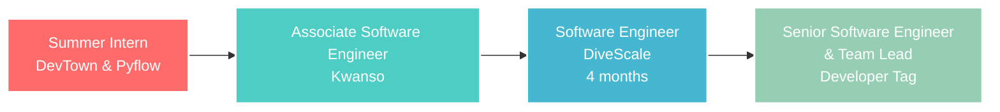

<div align="center">
  
</div>

<div align="center">
  
  [](https://git.io/typing-svg)
  
</div>

<br/>

<div align="center">
  
  
  
</div>

<div align="center">
  
</div>

---

## 🚀 **About Me**


🎓 **PUCIT Graduate** with 4.0 CGPA in core programming subjects  
💼 **Senior Software Engineer & Team Lead** at Developer Tag  
🏆 **Top 10 Rank** in ICPC Asia Online Preliminary Programming Contest 2023  
⭐ **LeetCode Top 5%** Problem Solver  
🌟 **"Student of the Year"** at Akhuwat College Kasur (2017)  


### 🎯 **Current Focus**
- 🔭 Leading backend architecture with **MERN/Next.js**
- 🤖 Building AI solutions with **LangChain & LangGraph**
- 🛠️ Implementing **DevOps** and **Git workflows**
- 📚 Exploring advanced **AWS** services

<br/>

<div align="center">
  
</div>

## 💻 **Tech Arsenal**

<div align="center">
  
  
  
</div>

<details>
<summary><b>🔥 Core Technologies</b></summary>
<br/>

<div align="center">
  
**Frontend Development**
<div>
  
</div>

**Backend Development**
<div>
  
</div>

**Databases & Cloud**
<div>
  
</div>

**Tools & DevOps**
<div>
  
</div>

</div>

</details>

<div align="center">
  
### **🎨 Skills Matrix**

| **Domain** | **Technologies** | **Proficiency** |
|------------|------------------|----------------|
| **Frontend** | React, Next.js, TypeScript, Vue.js |  |
| **Backend** | Node.js, Express.js, Python, Flask |  |
| **Database** | MongoDB, PostgreSQL, MySQL |  |
| **AI/ML** | LangChain, LangGraph, LLMs |  |
| **Cloud** | AWS, Firebase |  |
| **DevOps** | Docker, Git/GitHub, CI/CD |  |

</div>

<div align="center">
  
</div>

---

## 🏢 **Professional Journey**

<div align="center">
  
</div>

<div align="center">



</div>

### 🎖️ **Key Achievements**

<div align="center">
   **Top 10 Rank** - ICPC Asia Online Preliminary Programming Contest 2023 
</div>

- 🏆 **"Student of the Year"** - Akhuwat College Kasur (2017)
- 🎯 **Rank 1** - Quick Mind Game Competition
- 💻 **LeetCode Top 5%** - Problem Solving Excellence
- 📈 **4.0 CGPA** - Core Programming Subjects at PUCIT

<div align="center">
  
</div>

---

## 📊 **GitHub Analytics**

<div align="center">
  
</div>

<div align="center">
  


</div>

<div align="center">
  


</div>

<div align="center">
  
### **🏆 GitHub Trophies**


</div>

<div align="center">
  
</div>

<div align="center">
  
### **📈 Contribution Graph**


</div>

<div align="center">
  
### **🐍 Contribution Snake Animation**
<picture>
  <source media="(prefers-color-scheme: dark)" srcset="https://raw.githubusercontent.com/connect2abdulaziz/connect2abdulaziz/output/github-contribution-grid-snake-dark.svg">
  <source media="(prefers-color-scheme: light)" srcset="https://raw.githubusercontent.com/connect2abdulaziz/connect2abdulaziz/output/github-contribution-grid-snake.svg">
  
</picture>

</div>

---

## 🎨 **Featured Projects**

<div align="center">
  
  
### **🌟 Spotlight Projects**

<table>
<tr>
<td width="50%">
<div align="center">
  
</div>

**🤖 AI-Powered Development Tools**
- LangChain & LangGraph implementations
- Advanced AI integrations
- Real-time chat applications

</td>
<td width="50%">
<div align="center">
  
</div>

**🚀 Full Stack Applications**
- MERN Stack masterpieces
- TypeScript-powered solutions
- Modern UI/UX designs

</td>
</tr>
</table>

</div>

<div align="center">
  
</div>

---

## 🌐 **Connect With Me**

<div align="center">
  
</div>

<div align="center">
  
[](https://linkedin.com/in/connect2abdulaziz)
[](https://connect2abdulaziz.github.io/abdulaziz/)
[](mailto:connect2abdulaziz@gmail.com)
[](https://leetcode.com/connect2abdulaziz)

</div>

<div align="center">
  
</div>

---

## 💡 **Current Status**

<div align="center">
  
</div>

<div align="center">
  
```typescript
const abdulAziz = {
    location: "Lahore, Pakistan 🇵🇰",
    role: "Senior Software Engineer & Team Lead",
    company: "Developer Tag",
    focusAreas: ["MERN Stack", "AI Integration", "Team Leadership"],
    currentlyLearning: ["Advanced AWS", "DevOps", "AI/ML"],
    lookingFor: "Innovative projects and collaboration opportunities",
    funFact: "I can debug code faster than I can explain why it works! 😄"
};
```

</div>

<div align="center">
  
</div>

---

## 📈 **Weekly Development Breakdown**

<div align="center">
  
</div>

<!--START_SECTION:waka-->
```text
TypeScript   8 hrs 35 mins   ████████████░░░░░░░░░░░░░   48.2%
JavaScript   4 hrs 12 mins   ██████░░░░░░░░░░░░░░░░░░░   23.6%
React        3 hrs 8 mins    ████░░░░░░░░░░░░░░░░░░░░░   17.6%
Python       1 hr 45 mins    ██░░░░░░░░░░░░░░░░░░░░░░░   9.8%
Other        8 mins          ░░░░░░░░░░░░░░░░░░░░░░░░░   0.8%
```
<!--END_SECTION:waka-->

<div align="center">
  
</div>

---

## 🎯 **2025 Goals**

<div align="center">
  
</div>

- 🚀 **Master advanced AI/ML concepts** and implement cutting-edge solutions
- 🌟 **Contribute to major open-source projects** in the React/Node.js ecosystem  
- 📚 **Mentor junior developers** and build a strong tech community
- 🏆 **Lead innovative projects** that make a real-world impact
- 🎓 **Pursue advanced certifications** in cloud technologies

<div align="center">
  
</div>

---

<div align="center">
  
### **💫 Let's Build Something Amazing Together!**


<div align="center">
  
</div>

**"Code is poetry written in logic. Let's create digital masterpieces that inspire and innovate!"**

⭐ **Star my repositories if you find them helpful!**  
🤝 **Open to collaborations and exciting opportunities**  
📫 **Reach out for any technical discussions or project ideas**


</div>
