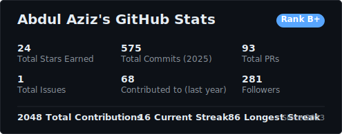
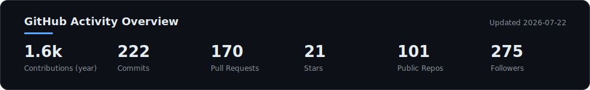
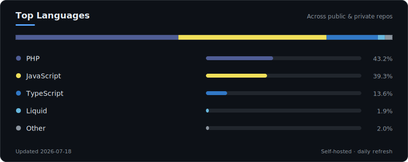

<!--
  Profile: connect2abdulaziz
  Auto-refreshed daily via .github/workflows/daily-profile.yml
-->

# Abdul Aziz

**Tech Lead · Senior Backend Engineer · AI Systems**

Building production SaaS, event-driven backends, and RAG-powered AI products.

 

 

---

### About

Tech Lead at **DeveloperTag**. I lead a team of 5 engineers shipping multi-tenant SaaS, real-time systems, and production AI assistants — with clean architecture, strong auth, and reliable CI/CD on AWS.

| | |
|---|---|
| **Experience** | 3+ years shipping SaaS, dashboards & microservices |
| **Competition** | ICPC Asia 2023 — Top 10 · LeetCode Top 5% (300+) |
| **Focus** | NestJS / Next.js platforms · RAG & agent systems · AWS DevOps |
| **Open source** | Daily profile metrics & language charts auto-maintained in this repo |

---

### What I build

- **Scalable backends** — NestJS, Node.js, PostgreSQL / MongoDB / Redis
- **Event-driven systems** — Docker, Bull / Kafka, observability, SLOs
- **AI & RAG** — LangChain, LangGraph, vector search, conversational agents
- **Real-time** — WebSockets, Socket.io, Redis pub/sub
- **Auth & tenancy** — RBAC / ABAC (CASL), RLS, OAuth 2.0, JWT
- **Leadership** — architecture reviews, CI/CD, mentoring, hiring

---

### Experience

**Tech Lead / Senior Backend Engineer** — DeveloperTag · Dec 2024 – Present  
Leading 5 engineers · multi-tenant SaaS with RLS · AI chatbots & RAG · GitHub Actions, Docker, AWS ECS · **60%** query performance gain

**Backend Engineer** — DiveScale · Jun 2024 – Dec 2024  
NestJS + GraphQL · OAuth 2.0 & sessions · real-time chat · **85%+** Jest coverage

**Associate Software Engineer** — Kwanso · Jun 2023 – Jun 2024  
Node.js / Express / NestJS · PostgreSQL & MongoDB · Swagger · code reviews

---

### Stack

  

<strong>Full stack</strong>

| Area | Tools |
|---|---|
| Languages | TypeScript, JavaScript, SQL, Python, Bash |
| Backend | NestJS, Node.js, Express, Fastify, Next.js API Routes |
| Data | PostgreSQL, MongoDB, Redis, Prisma, TypeORM, PostGIS, Pinecone, Supabase |
| AI / ML | LangChain, LangGraph, OpenAI, RAG, vector DBs, prompt engineering |
| Real-time | WebSockets, Socket.io, Redis Pub/Sub, Bull, SSE |
| Auth | RBAC, ABAC, CASL, RLS, JWT, OAuth 2.0 |
| Cloud | Docker, AWS (EC2, ECS, S3, RDS, Lambda, CloudFront), GCP, GitHub Actions |
| Quality | Clean Architecture, SOLID, TDD, OpenAPI, Jest |

---

### Selected work

> Client repos stay private. Case studies live on the [portfolio](https://connect2abdulaziz-psi.vercel.app). Reach out for access.

| Project | Role / outcome | Stack |
|---|---|---|
| **SimplyFlow** | Workflow automation + AI agent decisions | NestJS, n8n, LangGraph, AWS |
| **Terzo.ai** | RAG chatbot, semantic search, live chat | NestJS, LangChain, Pinecone, Redis |
| **GuardXP** | Multi-tenant security ops & event sourcing | NestJS, CASL, PostgreSQL, Turborepo |
| **FitnessAds.ai** | AI ad generation + consultation agent | NestJS, LangGraph, Docker |
| **SafeStreet** | Geospatial incidents & proximity alerts | NestJS, PostGIS, WebSockets |
| **QuizApp** | Live quizzes for 1000+ concurrent users | NestJS, Redis, Bull, WebSockets |
| **LMS** | Courses, streaming, live classes | NestJS, S3, CloudFront |
| **4Corners** | E-commerce, Stripe, inventory locking | NestJS, Stripe, Redis, S3 |
| **AutoPostMD** | Social scheduling & queue jobs | Node.js, Meta/LinkedIn APIs |

---

### GitHub activity

<!-- Self-hosted SVGs — refreshed daily by Actions (no vercel/heroku deps) -->

  <picture>
    <source media="(prefers-color-scheme: dark)" srcset="./github-stats-dark.svg" />
    <source media="(prefers-color-scheme: light)" srcset="./github-stats-light.svg" />
    
  </picture>

  

  <picture>
    <source media="(prefers-color-scheme: dark)" srcset="./languages-dark.svg" />
    <source media="(prefers-color-scheme: light)" srcset="./languages-light.svg" />
    
  </picture>

---

### Highlights

- **ICPC Asia Online Preliminary 2023** — Top 10
- **LeetCode Top 5%** — 300+ problems solved
- **50+ client projects** delivered across products and platforms
- **Student of the Year** — Akhuwat College

**Education** — BS Computer Science, PUCIT (2019 – 2023)

---

### Practices

Architecture decisions (ADRs) · blameless post-mortems · automated quality gates · operability (logs, traces, SLOs) · small frequent releases

---

### Let's work together

Open to interesting backend, platform, and AI product problems.

[Portfolio](https://connect2abdulaziz-psi.vercel.app) · [LinkedIn](https://linkedin.com/in/connect2abdulaziz) · [Email](mailto:connect2abdulaziz@gmail.com)

 

Profile metrics refresh daily via GitHub Actions

